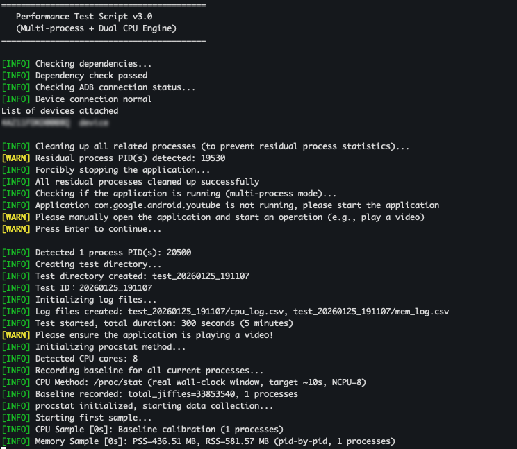
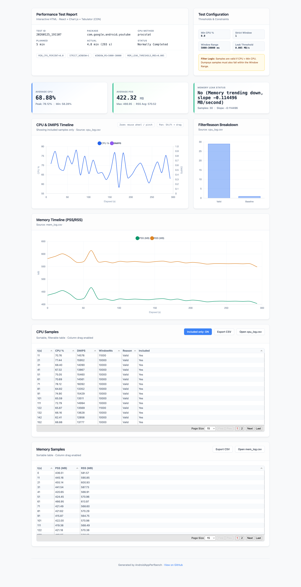

# Android Application Performance Testing Guide (English Version)

Languages: [English](README.md) | [简体中文](README-CN.md) 

Docs: [Technical Doc (EN)](doc/what_can_I_do.md) | [技术文档 (CN)](doc/what_can_I_do_cn.md) | [技術ドキュメント (JA)](doc/what_can_I_do_ja.md)

> **Test Objective**: Measure CPU and memory performance of a specific Android application during usage  
> **Test Platform**: macOS, Linux + Android device

---

## Step 1: Preparation Before Testing

### 1.1 Ensure You Have the Following

- ✅ **Android device** (phone, tablet, or other Android hardware)
- ✅ **USB cable** (to connect your device to your computer)
- ✅ The **app to be tested** is already installed on the Android device

### 1.2 Understand the App You're Testing

Before you start, you should know:

1. **The package name** of the app
   - This is the unique identifier of the app on the Android system
   - Format usually looks like: `com.company.appname`

2. **How to find the package name?**

   **Method 1: Ask the developer** (easiest)
   - Simply ask the developer for the package name

   **Method 2: Check on the Android device** (requires device connection)
   ```bash
   # List all installed packages
   adb shell pm list packages

   # Search for a specific app (replace youtube with your app's name)
   adb shell pm list packages | grep youtube
   ```

### 1.3 Define the Test Scenario

You need to be clear on:
- What function are you testing? (e.g., video playback, map navigation)
- How long will the test last? (recommended: 5–20 minutes)
- What user actions are required? (e.g., start video playback, swipe page)

---

## Step 2: Install Required Tools

### 2.1 Ensure the Following Tools Are Installed

The test script requires these tools:

| Tool   | Description           | Install Command (for macOS)                  |
|--------|------------------------|----------------------------------------------|
| **adb** | Android Debug Bridge  | `brew install --cask android-platform-tools` |
| **bc**  | Command-line calculator | `brew install bc`                            |
| **awk** | Text processing tool  | Built-in on most systems                     |

### 2.2 Verify Tools Are Installed

Run this in the terminal:

```bash
adb --version && bc --version && echo "✅ All tools installed"
```

If any tool is **missing**, follow the install instructions above.

---

## Step 3: Connect Android Device

In the terminal, run:
```bash
adb devices
```

**Expected output:**
```
List of devices attached
ABCD1234567890	device
```

**Explanation:**
- `ABCD1234567890`: your device’s serial number (unique per device)
- `device`: means it's connected and authorized

If you see `unauthorized`:
- Check the device screen for a prompt and click "Allow"

If no device appears:
- Reconnect the USB cable
- Ensure **USB debugging** is enabled on the Android device

### 3.5 Multiple Devices Connected?

You might see:
```
List of devices attached
ABCD1234	device
EFGH5678	device
```

Options:
1. **Recommended**: test with only one device connected
2. Or: specify the device serial number in the script (see Step 4)

---

## Step 4: Configure the Test Script

### 4.1 Download the Script

File name: `android_app_perfbench.sh`

### 4.2 Required Configuration

Open the script and modify the following settings:

#### App Package Name (Required)
```bash
PACKAGE_NAME="com.xxx.yyy"
```

Set your app’s package name:
```bash
PACKAGE_NAME="your.package.name"
```

#### Test Duration
```bash
TEST_DURATION_MINUTES=5
```

Change this based on your test plan (e.g., 10, 15, 20 minutes)

#### Sampling Interval (Usually Not Changed)

```bash
CPU_INTERVAL=10
MEM_INTERVAL=10
```

#### ADB Device Serial Number (Only if multiple devices)
```bash
ADB_SERIAL=""
```

Specify like:
```bash
ADB_SERIAL="ABCD1234567890"
```

#### CPU Performance (DMIPS per core)
```bash
SINGLE_CORE_DMIPS=20000
```

Adjust based on your CPU info:
- Formula 1: `Total DMIPS / CPU cores`
- Formula 2: `Sum of per-core DMIPS / core count`

#### Optional: Generate Interactive HTML Report
```bash
GENERATE_HTML_REPORT=1
```

- `1`: generate `report.html` in the test output directory (interactive charts/tables)
- `0`: skip HTML generation and only output `report.md`

Note: the HTML report references CDN assets; an internet connection may be required when opening it.

---

## Step 5: Run the Performance Test

### 5.1 Preparation

Give the script execution permission:
```bash
chmod +x android_app_perfbench.sh
```

### 5.2 Launch the Test

Before running the script:
- ✅ Make sure the app is **not running**
- ✅ Connect the charging cable
- ✅ Keep the screen **always on**

Run:
```bash
./android_app_perfbench.sh
```

You’ll be prompted like:
```
[INFO] Application com.xxx.xxx is not running, please start the application
[WARN] Please manually open the app and begin operations (e.g., play video)
[WARN] Press Enter to continue...
```

Steps:
1. Open the app
2. Perform the target operation (e.g., play video)
3. Press **Enter** in the terminal

Test will begin and print logs:
```
[INFO] Starting test, total duration: 300 seconds (5 minutes)
[INFO] CPU sampling [10s]: 48.00% → 9600 DMIPS
[INFO] Memory sampling [10s]: PSS=122.30 MB, RSS=252.10 MB (pid-by-pid, 3 processes)
```

**Script Running Example:**



### 5.3 Early Stop

To manually stop the test:
- Press `Ctrl + C`
- Report will be generated with current data

### 5.4 Completion

When the test ends:
```
[INFO] Test completed!
[INFO] Report generated: ./test_20260108_123456/report.md
```

Includes:
- CPU data: `cpu_log.csv`
- Memory data: `mem_log.csv`
- Final report: `report.md`
- Optional HTML report: `report.html`

Open the HTML report:
```bash
# macOS
open ./test_20260108_123456/report.html

# Linux (common)
xdg-open ./test_20260108_123456/report.html
```

**HTML Report Example:**



---

## Troubleshooting

### ❓ App Not Running

Possible causes:
1. App is indeed not running
2. Incorrect package name

Fix:
```bash
adb shell ps -A | grep -i yourapp
```

### ❓ CPU Usage Over 100%?

This is **normal**!

Reason:
- Multi-core devices = possible usage > 100%

Example:
- 4 cores = max 400%
- 8 cores = max 800%

### ⚠️ Multi-Process Apps

Apps may use:
- `com.xxx.app` — main process
- `com.xxx.app:media` — media
- `com.xxx.app:render` — render

Script collects all relevant processes.

---

## 📚 Appendix: Quick Reference

```bash
adb --version && bc --version      # Check tools
adb devices                        # List devices
adb shell pm list packages         # List all packages
adb shell ps -A | grep yourapp     # Check app running
adb shell am force-stop yourapp   # Force stop
adb kill-server && adb start-server # Restart ADB
chmod +x your_script.sh            # Make script executable
./your_script.sh                   # Run test
cat test_xxxxxx/report.md          # View report
open -a "Microsoft Excel" file.csv # Open CSV
```

**Good luck testing!** 🚀
